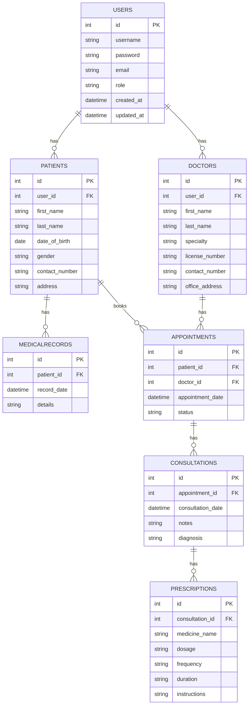

# Esquema de Banco de Dados

## Tabelas

---

```mermaid
erDiagram
    USERS {
        int id PK
        string username
        string password
        string email
        string role
        datetime created_at
        datetime updated_at
    }

    PATIENTS {
        int id PK
        int user_id FK
        string first_name
        string last_name
        date date_of_birth
        string gender
        string contact_number
        string address
    }

    DOCTORS {
        int id PK
        int user_id FK
        string first_name
        string last_name
        string specialty
        string license_number
        string contact_number
        string office_address
    }

    MEDICALRECORDS {
        int id PK
        int patient_id FK
        datetime record_date
        string details
    }

    APPOINTMENTS {
        int id PK
        int patient_id FK
        int doctor_id FK
        datetime appointment_date
        string status
    }

    PRESCRIPTIONS {
        int id PK
        int consultation_id FK
        string medicine_name
        string dosage
        string frequency
        string duration
        string instructions
    }

    CONSULTATIONS {
        int id PK
        int appointment_id FK
        datetime consultation_date
        string notes
        string diagnosis
    }

    USERS ||--o{ PATIENTS : "has"
    USERS ||--o{ DOCTORS : "has"
    PATIENTS ||--o{ MEDICALRECORDS : "has"
    PATIENTS ||--o{ APPOINTMENTS : "books"
    DOCTORS ||--o{ APPOINTMENTS : "has"
    APPOINTMENTS ||--o{ CONSULTATIONS : "has"
    CONSULTATIONS ||--o{ PRESCRIPTIONS : "has"
```